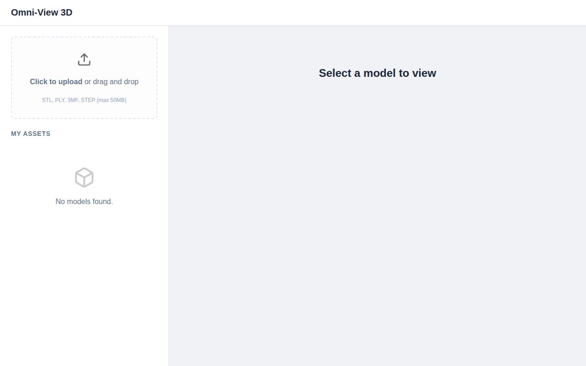
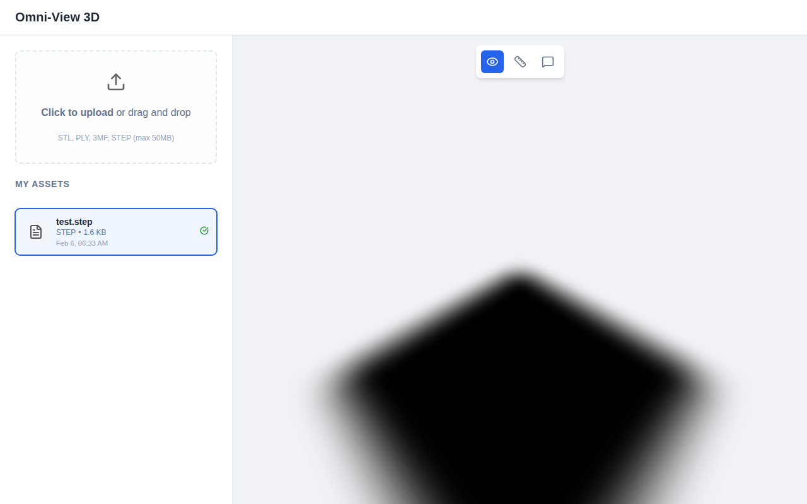

# Omni-View-3D


**Omni-View-3D** is a full-stack MERN application for uploading, managing, and viewing 3D models. It supports various 3D file formats and provides tools for interaction, measurement, and annotation.

## Features

*   **3D Model Support**: Upload and view STL, PLY, 3MF, and STEP files.
*   **Interactive Viewer**: Orbit, zoom, and pan around your models using `@react-three/fiber`.
*   **Measurement Tools**: Measure the point-to-point distance on the model surface.
*   **Annotations**: Add text annotations to specific points on the 3D model.
*   **STEP Conversion**: Includes a mocked process for converting STEP files to GLB for web viewing.
*   **File Management**: Upload, list, and store 3D assets using MongoDB GridFS.

## Screenshots


*The main dashboard with the upload zone and asset list.*


*Interactive 3D viewer displaying a model.*

## Tech Stack

### Frontend
*   **React** (v19)
*   **Vite** (v6)
*   **@react-three/fiber** & **@react-three/drei** (3D Rendering)
*   **Axios** (HTTP Client)

### Backend
*   **Node.js** & **Express**
*   **MongoDB** (using `mongodb-memory-server` for easy setup)
*   **Mongoose** (ODM)
*   **Multer** (File Uploads)

## Prerequisites

*   [Node.js](https://nodejs.org/) (v18 or higher recommended)
*   npm (Node Package Manager)

## Installation

1.  **Clone the repository:**
    ```bash
    git clone https://github.com/Shubhamvumap123/Omni-View-3D.git
    cd Omni-View-3D
    ```

2.  **Install dependencies:**

    You need to install dependencies for the root, server, and client.

    ```bash
    # Root dependencies
    npm install

    # Server dependencies
    cd server
    npm install
    cd ..

    # Client dependencies
    cd client
    npm install
    cd ..
    ```

## Usage

To start both the client and server concurrently:

```bash
npm start
```

*   The **Server** runs on `http://localhost:3000`.
*   The **Client** runs on `http://localhost:5173` (or the port assigned by Vite).

Open your browser and navigate to the client URL to use the application.

## API Documentation

### Upload File
*   **Endpoint**: `POST /api/upload`
*   **Description**: Uploads a 3D model file.
*   **Body**: `multipart/form-data` with field `file`.
*   **Response**: JSON object of the created asset.

### List Assets
*   **Endpoint**: `GET /api/assets`
*   **Description**: Retrieves a list of all uploaded 3D assets.
*   **Response**: JSON array of asset objects.

### Get File Content
*   **Endpoint**: `GET /api/files/:id`
*   **Description**: Downloads the file content (streamed from GridFS).
*   **Params**: `id` - The MongoDB ObjectId of the file.

### Create Annotation
*   **Endpoint**: `POST /api/annotations`
*   **Description**: Adds an annotation to a model.
*   **Body**: JSON object `{ assetId, text, position: { x, y, z }, cameraState }`.
*   **Response**: JSON object of the created annotation.

### Get Annotations
*   **Endpoint**: `GET /api/annotations/:assetId`
*   **Description**: Retrieves all annotations for a specific asset.
*   **Params**: `assetId` - The ID of the model asset.
*   **Response**: JSON array of annotations.

## Project Structure

```
Omni-View-3D/
├── client/                 # Frontend React application
│   ├── src/
│   │   ├── components/     # React components (Viewer, UploadZone, etc.)
│   │   └── ...
│   └── ...
├── server/                 # Backend Express application
│   ├── samples/            # Sample files (for mocked conversion)
│   ├── index.js            # Server entry point
│   ├── models.js           # Mongoose models
│   └── ...
├── package.json            # Root configuration and scripts
└── ...
```

## License

This project is licensed under the ISC License.
